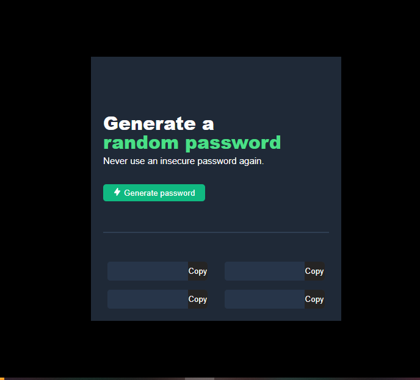

# Random password generator

> A random password generator that suggest password to users.



## Built With

- HTML
- CSS
- javaScript

## Live Demo

[Live Demo Link](random-pasword-gen.netlify.app)

### Development (Running locally)

- Clone the project

```bash
git clone git@github.com:Yinkusadel/random-password-generator.git

```

- Install Dependencies

```bash
yarn install
```

To run StyleLint by itself, you may run the lint task:

```bash
yarn stylelint:check
```

Or to automatically fix issues found for StyleLint (where possible):

```bash
yarn stylelint
```

To run ESLint by itself, you may run the lint task:

```bash
yarn eslint:check
```

Or to automatically fix issues found for ESLint (where possible):

```bash
yarn eslint
```

You can also check against Prettier:

```bash
yarn format:check
```

and to have it fix (to the best of its ability) any format issues, run:

```bash
yarn format
```

You can also check against HTML Validator (htmlhint):

```bash
yarn lint:html
```

To generate an accessibility report for this webpage, run the below command, it uses axe:

```bash
yarn axe
```

## Style Guides

- [CSS Style Guide](http://udacity.github.io/frontend-nanodegree-styleguide/css.html)
- [HTML Style Guide](http://udacity.github.io/frontend-nanodegree-styleguide/index.html)
- [JavaScript Style Guide](http://udacity.github.io/frontend-nanodegree-styleguide/javascript.html)
- [Git Style Guide](https://udacity.github.io/git-styleguide/)
- [AXE Accessibility Style Guide](https://dequeuniversity.com/rules/axe/html/4.7)

## 👤 Author

- Github: [@yinkusadel](https://github.com/yinkusadel)
- Twitter: [@HashiraAdel](https://twitter.com/HashiraAdel)
- Linkedin: [@adeleyeolayinka](https://www.linkedin.com/in/adeleye-olayinka/)

## 🤝 Contributing

Contributions, issues and feature requests are welcome!

Feel free to check the [issues page](../../issues).

## Show your support

Give a ⭐️ if you like this project!

## Acknowledgments

- figma design: [@figma-design](https://www.figma.com/file/YRO9Iw5IYaOorjnRyNz4bV/Random-Password-Generator?type=design&node-id=102-702&mode=design&t=yWzDo5qAQSHUnGT5-0)

## 📝 License

[MIT licensed](./LICENSE).
